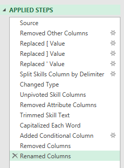

# Data_jobs_Analysis
Proyecto completo en EXCEL/POWER BI. Preparamos, procesamos, analizamos, y por ultimo compartimos en dashboards interactivos, informacion sobre el mercado laboral en la ciencia de datos de todo el mundo. El Proyecto fue realizado con la guia de @LukeBarousse.

## Introducción

Como buscador de empleo, siempre me ha sorprendido la falta de datos que exploren los empleos y las habilidades más óptimos en el mercado de la ciencia de datos. Me propuse comprender qué habilidades solicitan los mejores empleadores y cómo conseguir un mejor salario.

### Preguntas para analizar
Para comprender el mercado laboral de la ciencia de datos, planteé las siguientes preguntas:

1. **¿Contar con más habilidades te da un mejor salario?**
2. **¿Cuál es el salario para los trabajos dentro de la ciencia de datos en diferentes regiones?**
3. **¿Cuáles son las principales habilidades de los profesionales de la ciencia de datos?**
4. **¿Cuál es el salario para las 10 principales habilidades?**

### Habilidades de Excel utilizadas

- **📊 Pivot Tables**
- **📈 Pivot Charts**
- **🧮 DAX (Data Analysis Expressions)**
- **🔍 Power Query**
- **💪 Power Pivot**

## Conjunto de datos de trabajos de datos

El dataset utilizado para este proyecto contiene información real sobre trabajos de ciencia de datos de 2023. Está disponible a través de mi curso de Excel, que proporciona las bases para analizar datos con Excel.

Incluye información detallada sobre:

- **👨‍💼 Puestos Laborales**
- **💰 Salarios**
- **📍 Ubicaciones**
- **🛠️ Habilidades**

## 1️⃣ ¿Más habilidades te permiten obtener un mejor salario?

### 🔍 Habilidades: Power Query (ETL)

#### 📥 Extraer

Primero usé Power Query para extraer los datos originales (`1_Project_Analysis.xlsx`) y crear dos consultas:

- 🗃️ La primera contiene toda la información de los puestos de trabajo.

- 🔧 La segunda enumera las habilidades de cada ID de puesto.

#### 🔄 Transformar

- Luego, transformé cada consulta cambiando los tipos de columna, eliminando columnas innecesarias, limpiando el texto para eliminar palabras específicas y eliminando el exceso de espacios en blanco.

- 📊 data_jobs_all


    - 🛠️ data_job_skills



#### 🔗 Cargar

- Finalmente, cargué ambas consultas transformadas en el workbook, sentando las bases para mi análisis posterior.
    - 📊 data_jobs_all

 

    - 🛠️ data_job_skills


### 📊 Analisis

#### 💡 Insights

- 📈 Existe una correlación positiva entre la cantidad de habilidades solicitadas en las ofertas de empleo y el salario medio, especialmente en puestos como Ingeniero de Datos Sénior y Científico de Datos.
- 💼 Los puestos que requieren menos habilidades, como Analista de Negocios, tienden a ofrecer salarios más bajos, lo que sugiere que las habilidades más especializadas tienen un mayor valor de mercado.


#### 🤔 

Esta tendencia enfatiza la importancia de adquirir múltiples habilidades relevantes, especialmente para quienes aspiran a puestos mejor remunerados.

## 2️⃣ ¿Cuál es el salario de los trabajos de datos en las diferentes regiones?

### 🧮 Habilidades: PivotTables & DAX

#### 📈Pivot Table

- 🔢 Creé una Pivot Table usando el Data model que creé con Power Pivot.
- 📊 Moví `job_title_short` al área de filas y `salary_year_avg` al área de valores.
- 🧮 Luego, agregué una nueva medida para calcular el salario medio en Estados Unidos.
    ```
    =CALCULATE(
        MEDIAN(data_jobs_all[salary_year_avg]),
        data_jobs_all[job_country] = "United States")
    ```

#### 🧮 DAX

- Para calcular el salario medio anual utilicé DAX.

    ```
    Median Salary := MEDIAN(data_jobs_all[salary_year_avg])
    ```

### 📊 Analisis

#### 💡 Conclusiones

- 💼 Los puestos de trabajo como senior data engineer y data scientists tienen salarios medios más altos tanto en EE. UU. como a nivel internacional, lo que demuestra la demanda global de experiencia en datos de alto nivel.
- 💰 La disparidad salarial entre los empleos estadounidenses y no estadounidenses es particularmente notable en los empleos de alta tecnología, lo que podría estar influenciado por la concentración de industrias tecnológicas en Estados Unidos.


#### **🤔 Entonces**

- Estos conocimientos salariales son importantes para la planificación y las negociaciones salariales, ayudando a los profesionales y a las empresas a alinear sus ofertas con los estándares del mercado teniendo en cuenta las variaciones geográficas.

## 3️⃣ ¿Cuáles son las principales habilidades de los profesionales en la ciencia de datos?

### 🔧 Habilidades: Power Pivot

#### 💪 Power Pivot

- 🔗 Creé un Data Model integrando las tablas `data_jobs_all` y `data_jobs_skills` en un solo modelo.
- 🧹 Como ya había limpiado los datos usando Power Query, Power Pivot creó una relación entre estas dos tablas.

#### 🔗 Data Model

- Creé una relación entre mis dos tablas usando la columna `job_id`.


#### 📃 Power Pivot Menu

- El menú de Power Pivot se utilizó para refinar mi Data model y facilita la creación de medidas.


### 📊Analisis

#### 💡Conclusiones

- 💻 SQL y Python dominan como habilidades principales en trabajos relacionados con datos, lo que refleja su papel fundamental en el procesamiento y análisis de datos.
- ☁️ Las tecnologías emergentes como AWS y Azure también muestran una presencia significativa, lo que subraya el cambio de la industria hacia los servicios en la nube y 
      las tecnologías de big data.


#### 🤔 Entonces..

- Comprender las habilidades prevalecientes en la industria no solo ayuda a los profesionales a mantenerse competitivos, sino que también orienta los programas de 
  capacitación y educación para centrarse en las tecnologías más impactantes.

## 4️⃣ ¿Cuál es el salario de las 10 habilidades más importantes?

### 📊 Habilidades: Graficos avanzados (Pivot Chart)

#### 📈 PivotChart

    - Creé un PivotChart combinado para trazar el salario medio y la probabilidad de habilidad (%) de mi PivotTable.
    - 🪙 **Eje principal:** Median Salary (como Clustered Column)
    - 👍 **Eje secundario:** Probabilidade de Habilidades (como una Linea con Marcadores)
- Para personalizar el gráfico, agregué un título al eje de título, eliminé las líneas (probabilidad de habilidad) y cambié los marcadores a diamantes.

### 📊 Analisis

#### 💡Conclusiones

- 💰 Los salarios medios más altos están asociados con habilidades como Python, Oracle y SQL, lo que sugiere su papel fundamental en empleos tecnológicos bien 
      remunerados.
- 📉 Habilidades como PowerPoint y Word tienen los salarios medios más bajos y la probabilidad más baja, lo que indica una menor especialización y demanda en sectores 
      con salarios altos.

 

### 🤔Entonces..

- Este gráfico destaca la importancia de invertir tiempo en aprender habilidades de alto valor como Python y SQL, que están evidentemente vinculadas a puestos mejor remunerados, especialmente para aquellos que buscan maximizar su salario en la industria tecnológica.

## Conclusiones

Como entusiasta de los datos y buscador de empleo, me embarqué en este proyecto basado en Excel para descubrir información valiosa sobre el mercado laboral en ciencia de datos. Utilizando un conjunto de datos que seleccioné de ofertas de empleo reales, analicé los puestos, los salarios, las ubicaciones y las habilidades esenciales. Al aprovechar funciones de Excel como Power Query, tablas dinámicas, DAX y gráficos, descubrí correlaciones clave entre múltiples habilidades y salarios más altos, especialmente en Python, SQL y tecnologías en la nube.

Espero que este proyecto sirva como guía práctica para profesionales en la ciencia de datos y ofrezca una visión general de las habilidades necesarias para puestos mejor remunerados.
